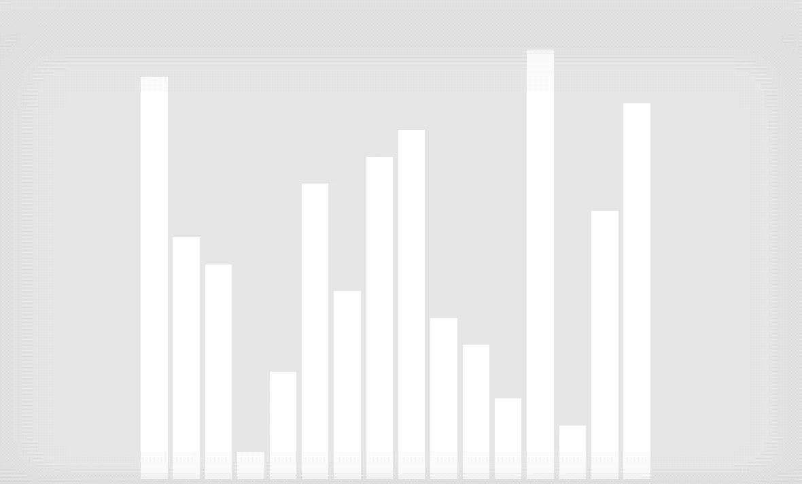
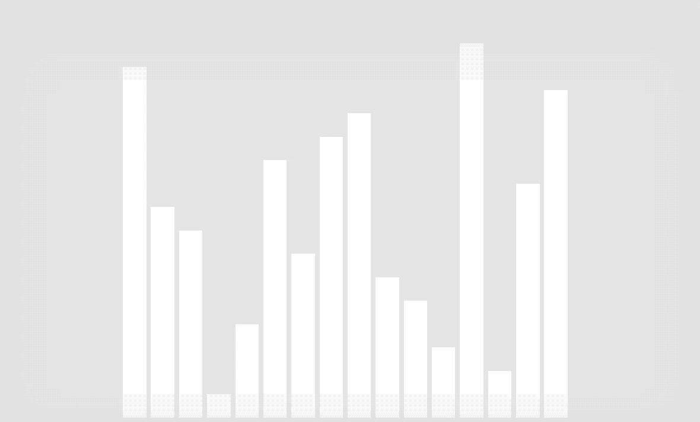
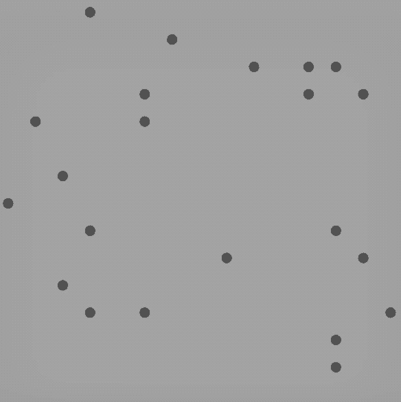
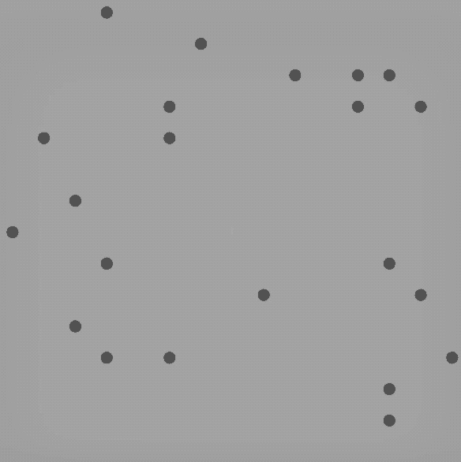
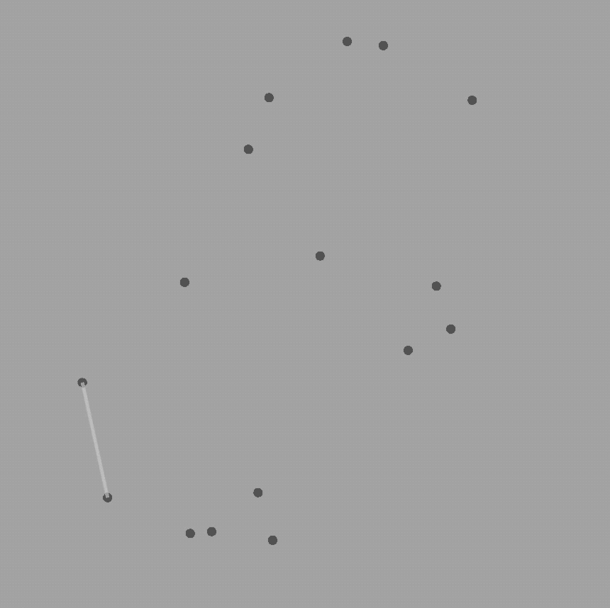

# Sorting Algorithms:

- Insertion Sort

- Median Sort

- Quicksort

- Heap Sort

- Bucket Sort

# Searching Algorithms:

- Binary Search
- Hash-Based Search
- Sequential Search

# Graph Algorithms:

- Depth-First Search  

- Breadth-First Search  

- Dijkstra's Priority Queue Search (weight is equal to neighbor vertices index difference)  

- Prim's Search (weight is equal to neighbor vertices index difference)  

- Floyd-Warshall (weight is equal to neighbor vertices index difference)  

# Path finding in AI Algorithms:

### Search tree 
- A* Search
    
### Game tree
- Minimax 
- NegMax
- AlphaBeta

# Computational Geometry Algorithms:

- Convex Hull Scan  

